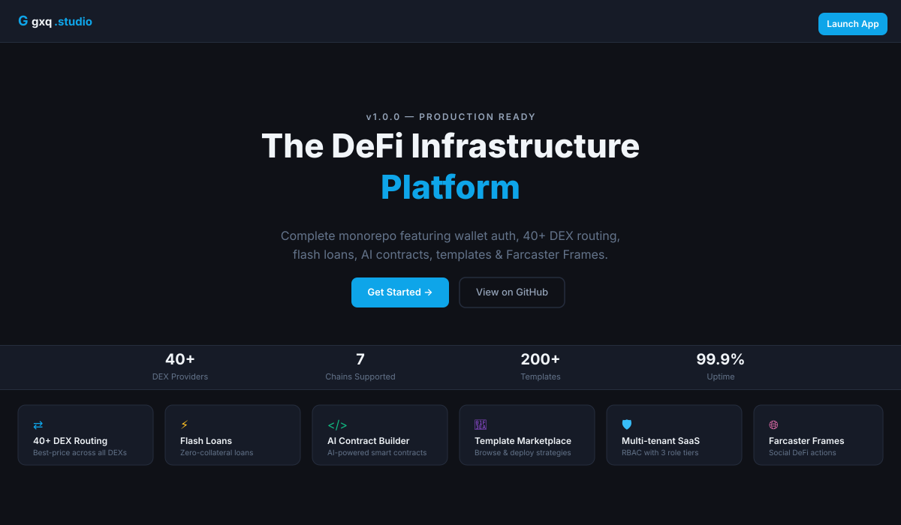
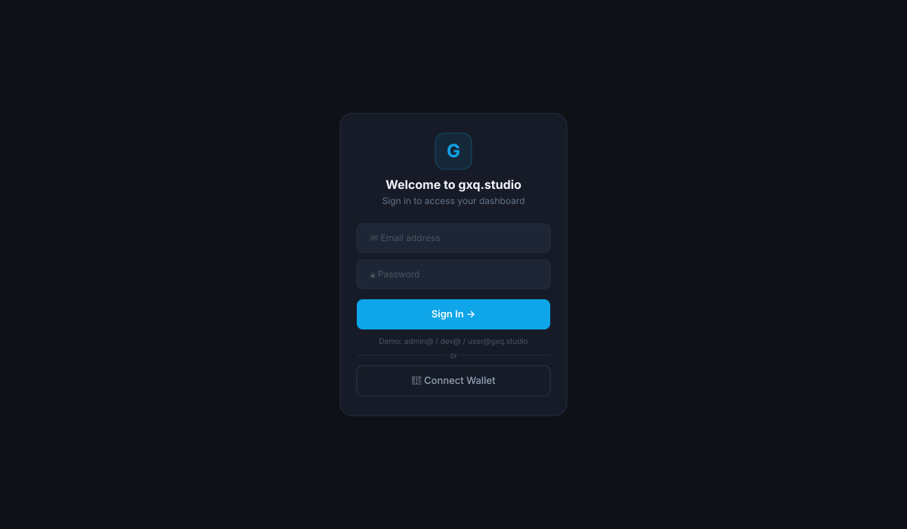
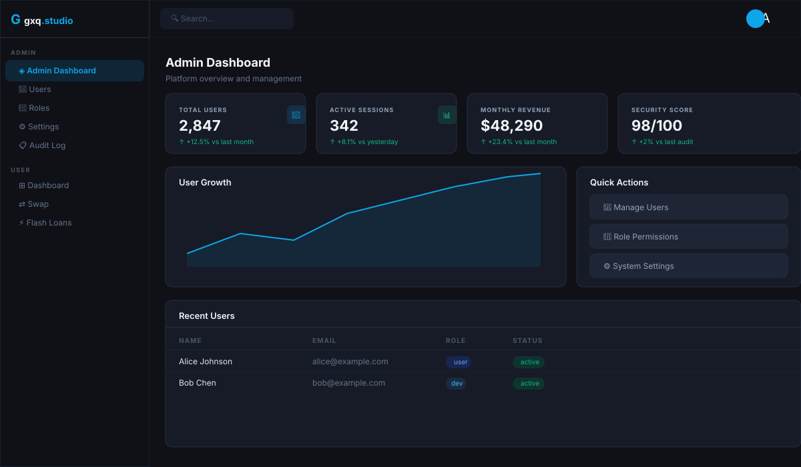
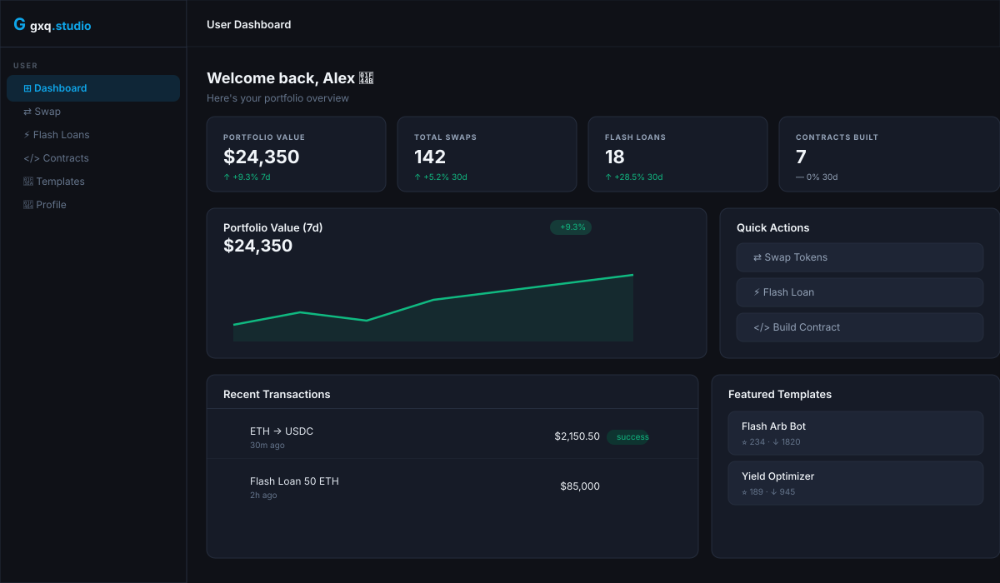
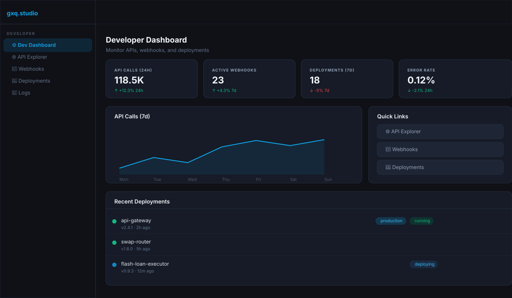
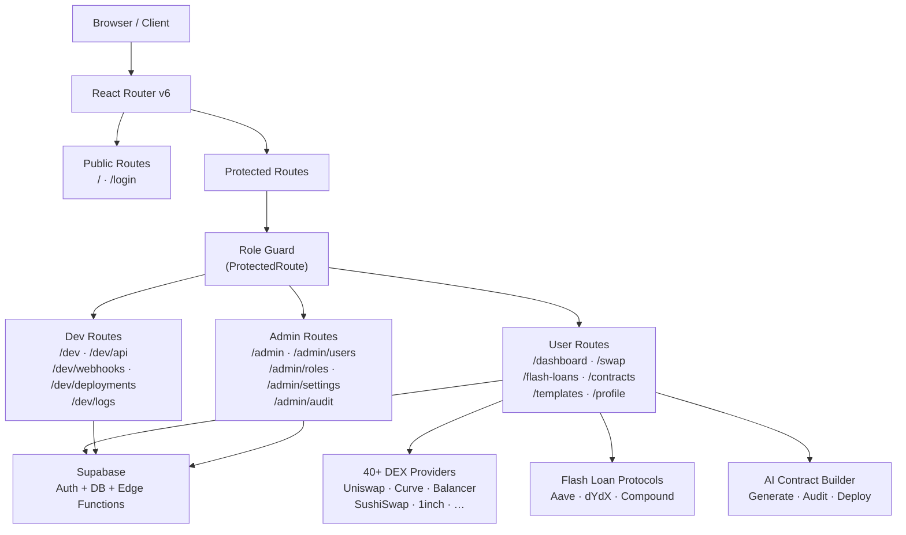

# gxq.studio

[](https://github.com/SMSDAO/gxq.studio/actions/workflows/ci.yml)
[](LICENSE)
[](package.json)
[](tsconfig.json)
[](package.json)

> **Complete production-ready monorepo featuring wallet authentication, best-price routing across 40+ DEX providers, flash loans, AI contract builder, template marketplace, Farcaster Frames, and comprehensive multi-tenant SaaS infrastructure.**

---

## 📸 Screenshots

### 🏠 Landing Page


### 🔐 Login / Wallet Connect


### 👑 Admin Dashboard


### 👤 User Dashboard


### 🛠️ Dev Dashboard


---

## 🏗️ Architecture



---

## 🛠 Tech Stack

| Layer | Technology |
|-------|-----------|
| Frontend | React 18, Vite 5, TypeScript 5 |
| Styling | TailwindCSS 3 (dark theme) |
| Icons | Lucide React |
| Routing | React Router v6 |
| Auth + DB | Supabase (auth, database, edge functions) |
| Package Manager | pnpm |
| CI | GitHub Actions |

---

## 🚀 Getting Started

### Prerequisites

- Node.js 18+
- pnpm 8+
- A [Supabase](https://supabase.com) project (optional for demo)

### Install

```bash
git clone https://github.com/SMSDAO/gxq.studio.git
cd gxq.studio
pnpm install
```

### Environment Setup

```bash
cp .env.example .env
```

Edit `.env` with your Supabase credentials:

```env
VITE_SUPABASE_URL=https://your-project.supabase.co
VITE_SUPABASE_ANON_KEY=your-anon-key
```

> **Note:** The app works in demo mode without real Supabase credentials using mock authentication.

### Run Development Server

```bash
pnpm dev
```

Open [http://localhost:5173](http://localhost:5173)

**Demo credentials:**
| Email | Password | Role |
|-------|----------|------|
| `admin@gxq.studio` | any | Admin |
| `dev@gxq.studio` | any | Dev |
| `user@gxq.studio` | any | User |

---

## 📁 Project Structure

```
gxq.studio/
├── .env.example              # Environment variable template
├── .github/
│   └── workflows/ci.yml      # CI pipeline (lint + build)
├── docs/screenshots/         # SVG dashboard mockups
├── index.html                # App entry point
├── package.json              # Dependencies and scripts
├── pnpm-workspace.yaml       # pnpm workspace config
├── postcss.config.js         # PostCSS config
├── tailwind.config.ts        # Tailwind + dark theme config
├── tsconfig.json             # TypeScript config with @/ alias
├── vite.config.ts            # Vite config with path aliases
└── src/
    ├── App.tsx               # Root component (Router + AuthProvider)
    ├── main.tsx              # React entry point
    ├── index.css             # Tailwind imports + global styles
    ├── vite-env.d.ts         # Vite env type declarations
    ├── lib/
    │   ├── supabase.ts       # Supabase client initialization
    │   ├── constants.ts      # App-wide constants (DEX list, nav items)
    │   └── utils.ts          # Utility functions (cn, formatCurrency, …)
    ├── types/
    │   ├── index.ts          # Shared types (Transaction, Template, …)
    │   ├── user.ts           # User and UserProfile interfaces
    │   └── roles.ts          # Role definitions and RBAC permissions
    ├── hooks/
    │   ├── useAuth.ts        # Auth hook re-export
    │   └── useRole.ts        # Role-checking hook (can, isAdmin, isDev)
    ├── contexts/
    │   └── AuthContext.tsx   # Auth context + mock sign-in
    ├── components/
    │   ├── ui/               # Reusable UI primitives
    │   │   ├── Button.tsx
    │   │   ├── Card.tsx
    │   │   ├── Badge.tsx
    │   │   ├── Input.tsx
    │   │   ├── Modal.tsx
    │   │   ├── Sidebar.tsx
    │   │   ├── Header.tsx
    │   │   ├── StatsCard.tsx
    │   │   └── Table.tsx
    │   ├── layout/
    │   │   ├── DashboardLayout.tsx
    │   │   ├── AdminLayout.tsx
    │   │   └── PublicLayout.tsx
    │   ├── auth/
    │   │   ├── LoginForm.tsx
    │   │   ├── WalletConnect.tsx
    │   │   └── ProtectedRoute.tsx
    │   └── charts/
    │       └── ActivityChart.tsx
    ├── pages/
    │   ├── Landing.tsx
    │   ├── Login.tsx
    │   ├── NotFound.tsx
    │   ├── admin/
    │   │   ├── AdminDashboard.tsx
    │   │   ├── UserManagement.tsx
    │   │   ├── RolePermissions.tsx
    │   │   ├── SystemSettings.tsx
    │   │   └── AuditLog.tsx
    │   ├── user/
    │   │   ├── UserDashboard.tsx
    │   │   ├── Profile.tsx
    │   │   ├── SwapInterface.tsx
    │   │   ├── FlashLoans.tsx
    │   │   ├── ContractBuilder.tsx
    │   │   └── Templates.tsx
    │   └── dev/
    │       ├── DevDashboard.tsx
    │       ├── APIExplorer.tsx
    │       ├── WebhookManager.tsx
    │       ├── DeploymentStatus.tsx
    │       └── Logs.tsx
    └── router/
        └── index.tsx         # Route definitions + role guards
```

---

## 🔐 Role Permissions

| Feature | User | Dev | Admin |
|---------|:----:|:---:|:-----:|
| Dashboard | ✅ | ✅ | ✅ |
| Swap Interface | ✅ | ✅ | ✅ |
| Flash Loans | ✅ | ✅ | ✅ |
| Contract Builder | ✅ | ✅ | ✅ |
| Template Marketplace | ✅ | ✅ | ✅ |
| Profile | ✅ | ✅ | ✅ |
| API Explorer | ❌ | ✅ | ✅ |
| Webhook Manager | ❌ | ✅ | ✅ |
| Deployment Status | ❌ | ✅ | ✅ |
| System Logs | ❌ | ✅ | ✅ |
| Admin Dashboard | ❌ | ❌ | ✅ |
| User Management | ❌ | ❌ | ✅ |
| Role Permissions | ❌ | ❌ | ✅ |
| System Settings | ❌ | ❌ | ✅ |
| Audit Log | ❌ | ❌ | ✅ |

---

## 📜 Available Scripts

```bash
pnpm dev        # Start dev server (http://localhost:5173)
pnpm build      # TypeScript check + Vite production build
pnpm preview    # Preview production build locally
pnpm typecheck  # TypeScript type checking (no emit)
pnpm lint       # ESLint check
```

---

## 🔧 Environment Variables

| Variable | Required | Description |
|----------|----------|-------------|
| `VITE_SUPABASE_URL` | No* | Supabase project URL |
| `VITE_SUPABASE_ANON_KEY` | No* | Supabase anonymous key |

*App works in demo mode without real credentials.

---

## 🚢 Deployment

### Vercel

```bash
pnpm build
# Deploy the `dist/` folder to Vercel
```

Or connect your GitHub repo directly and Vercel auto-detects Vite.

### Netlify

```toml
# netlify.toml
[build]
  command = "pnpm build"
  publish = "dist"

[[redirects]]
  from = "/*"
  to = "/index.html"
  status = 200
```

### Docker

```dockerfile
FROM node:20-alpine AS builder
RUN npm i -g pnpm
WORKDIR /app
COPY . .
RUN pnpm install --frozen-lockfile && pnpm build

FROM nginx:alpine
COPY --from=builder /app/dist /usr/share/nginx/html
COPY nginx.conf /etc/nginx/conf.d/default.conf
```

---

## 🤝 Contributing

1. Fork the repository
2. Create a feature branch: `git checkout -b feat/my-feature`
3. Commit your changes: `git commit -m 'feat: add my feature'`
4. Push to branch: `git push origin feat/my-feature`
5. Open a Pull Request

Please follow [Conventional Commits](https://conventionalcommits.org/) for commit messages.

---

## 📄 License

[MIT](LICENSE) © 2024 SMSDAO
